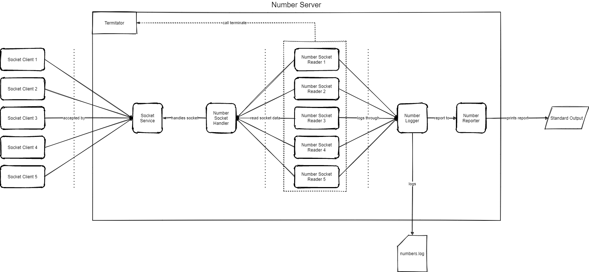

# Number Server

Number Server is a stand-alone application able to accept multiple socket
connections over TCP/IP for writing numbers in a single log file free from duplicates.

## Prerequisites

In order to run Number Server on your machine you need:
* Java 11+ (how to install [here](https://www.oracle.com/java/technologies/javase-downloads.html))
* Maven (how to install [here](https://maven.apache.org/install.html))

## Quick start

The easiest way to start Number Server is typing from the project folder the command:
```
mvn clean install exec:java
```
It will start the application, create the logging file (by default `numbers.log`) and listen the port (by default `4000`) for 
numbers to write in the file; if the file already exists it will be cleared.
The maximum number of connections is set to five by default.

Periodically (by default 10 sec) the application prints on standard output a report 
containing:
* The difference since the last report of the count of new unique numbers that have
  been received;
* The difference since the last report of the count of new duplicate numbers that 
  have been received;
* The total number of unique numbers received for this run of the Application.

An example of report could be the following:
```
Received 50 unique numbers, 2 duplicates. Unique total: 567231
```

### Tune the application

It is possible to pass some arguments at the startup to modify some default behaviors by running 
the command:
```
mvn clean install exec:java -Dexec.args="arg0=value0 arg1=value1 ..."
```
The accepted arguments are:
* `port` (default `4000`) - define the listening port;
* `logFile` (default `numbers.log`) - define the file's path where logging the numbers;
* `maxConnections` (default `5`) - define the maximum number of connections accepted;
* `reportPeriod` (default `10000`) - define how long is the period (in milliseconds)
  between each report.
  
## The communication protocol
It is possible to send numbers to the Number Server by using `telnet` (or `PuTTY` for windows) clients.
For example by typing on your terminal `telnet localhost 4000`.

Once the client session is created, a number can be sent by simply typing it and press enter.
There are few rules to follow by the way:
* A number can be composed by at most 9 digits (e.g. `314159265` or `007007009`);
* If a number is composed by less than 9 digits, it must include leading zeros till reach 9 digits;
* Any invalid sent number will disconnect the client;
* Typing `terminate` followed by enter will stop Number Server and disconnect all the clients.

## Architecture



There are five main component in the design:
* `SocketService` - its function is to accept socket connections by listening the specified port;
* `NumberServiceHandler` - once the socket connection is accepted the socket is passed to this handler
  that try to dispatch the socket stream to some free `NumberSocketReader`; it also is responsible to
  manage the lifecycle of the socket.
* `NumberSocketReader` - it reads the data sent through the socket; if the data is a valid number then
  it is passed to `NumberLogger` to log it; the read continues till an invalid number is sent; if a
  `temination` is required the `Terminatior` is called;
* `NumberLogger` - it is a thread safe module with the responsibility of writing to the log file
  those numbers that are not duplicated. It also notifies the `NumberReporter` if the received number
  was a duplicated or not;
* `NumberReporter` - it keeps the count of uniques, duplicates and total uniques numbers between each report
  and print them to standard output.

## Performance

Number server has been tested on a Windows 10 laptop with 1.6 GHz intel i5 8th gen processor and 16 GB of RAM.
The implementation proved to be able to handle more than 2M of numbers per 10 seconds.

Test                            | 2M of numbers (sec)    | Throughput (numbers/sec)
--------------------------------|-----------------------|-------------------------
1 socket client                 |1,87                   | 1,06 M
5 socket clients all duplicates |4,60                   | 0,43 M
5 socket clients no duplicates  |5,59                   | 0,35 M

## Development style

Number Server has been developed following as much as possible TDD approach that lead to a final
code coverage of `87%`.

## Technical decisions

* The socket stream is read using a `java.io.BufferedReader` which proved better performance respect to
  `java.util.Scanner`;
* File is written using `java.io.FileWriter` because of its performance;
* The numbers logged in the log file are plain numbers without leading zeros because it was not
  specified in the requirements.

## Future improvements
The current architecture work just fine with a reduced and limited number of connection. On the other hand,
it has a potential limit on the scalability if the number of connections increase a lot.

In fact, each reader is running on its own thread and could lead to memory limitations. It should be possible
overcome this limitation by taking advantage of the non-blocking I/O provided by `java.nio.channels.ServerSocketChannel`
(instead of `java.net.ServerSocket`) and reading the channel stream with a single reader.

By the way, using a single reader could potentially reduce the throughput of the application.

---
Now that you know everything enjoy the Number Server :)